# State

> Last updated: 2026-07-07

## Progress

```mermaid
stateDiagram-v2
    [*] --> Phase0: project started
    Phase0 --> Phase1: foundation merged
    Phase1 --> Phase2: schema + providers merged
    Phase2 --> Phase3: core pipeline merged
    Phase3 --> Phase4: search surfaces merged
    Phase4 --> Phase5: UI shell merged
    Phase5 --> Phase6: source viewer merged
    Phase6 --> Phase7: recommendations UI merged
    Phase7 --> Phase8: progress updates merged
    Phase8 --> Phase9: hosted-mode auth merged
    Phase9 --> Phase10: polish + 1.0 release
    Phase10 --> Phase10a: pipeline perf fixes
    Phase10a --> Phase10b: UI enhancements
    Phase10a --> Phase10c: tsvector column migration
    Phase10c --> Phase11: configurable providers
    Phase11 --> Phase10d: Playwright E2E + CI + 1.0 tag
    Phase10d --> Live: 1.0 release

    note right of Phase10c: ✅ generated tsv columns on sources, source_pages, recommendations + GIN indexes
    note right of Phase11: ← WE ARE HERE — PR1 (foundation) merged; PR2/PR3 (write API + UI) partially done
    note right of Phase10d: Playwright specs + CI pipeline exist; worker.smoke test flaky
```

- **Phase 0** ✅ merged (PR #1) — Next.js 16 + Postgres compose, CI green, MIT license.
- **Phase 1** ✅ merged (PR #2) — 13 tables across 4 migrations, 5 provider fakes, repository layer scaffold, taxonomy seed, 45 Testcontainers-backed tests.
- **Docs pass** ✅ merged (PR #3) — README rewrite, mkdocs Material site (`docs/index.md`, `user-guide.md`, `changelog.md`).
- **Phase 2** ✅ merged (PR #4) — pg-boss queues + worker sidecar, parse/extract/embed handlers, SSE progress via `pg_notify`, real OpenAI-compat LLM + embedding adapters, Docling + Mistral OCR adapters, `/api/sources` upload, `/api/recommendations` keyword search, end-to-end pipeline test, fixture corpus.
- **Phase 3** ✅ merged (PR #5) — `/api/search` (hybrid RRF), `/api/keyword-search` (keyword + degrade path), `POST /api/chat-search` (streaming RAG over `source_pages` with `[[source:slug#page:N]]` citations), 60s query embedding cache, citation marker grammar.
- **Codex review fixes** ✅ merged (PR #6) — chat-search DB pool leak; query-embedding-cache NUL byte that broke git's diff classification.
- **Phase 4** ✅ merged (PR #7) — shadcn/ui-based primitives, dark mode (next-themes), three route groups `(app)/(marketing)/(auth)`, mode-aware root redirect, `<FeatureGate>`, Navigation + Footer, DecisionFlow first-launch flow, dashboard stub with recent jobs + sources cards.
- **Phase 5** ✅ merged (PR #8) — `/sources/[slug]` split-pane viewer with synced scroll via IntersectionObserver, HMAC-signed `/api/files/[token]` route + `signFileToken/verifyFileToken` helpers, image-rewrite rehype plugin, `useScrollSync` hook, `getSourceWithPagesBySlug` repo helper.
- **Phase 6** ✅ merged (PR #9) — `/recommendations` index (TanStack Table, URL-driven filters, hybrid/keyword toggle), `/recommendations/[id]` detail with shadcn Tabs (Overview / Similar / Progress), `findRecommendationById` + `findSimilarRecommendations` + `listRecentRecommendations` repo helpers, `<FilterChips>`, `useSearchParamsState` hook.
- **Phase 7** ✅ — progress updates: `<ProgressUpdateForm>` (RHF + Zod), `<ProgressUpdatesList>`, `<StatusBadge>` + `<StatusTransitionControl>` on the detail page, `<EditableSelectCell>` + Status column on the index table; `getLatestStatuses` SQL helper, `createProgressUpdate` + `listProgressUpdates` + `appendStatus` repos, server actions + shared Zod schemas.
- **Phase 8** ✅ — hosted mode: Better-auth (email+password + magic link) wired via `BetterAuthProvider` behind the existing `AuthContext`; new `users` / `sessions` / `accounts` / `verifications` / `user_roles` schema with FKs on the existing nullable user-ref columns; `EmailProvider` interface + console-logger fake; first-signup-becomes-admin bootstrap; `/signup` / `/login` / `/magic-link` / `/forgot-password` / `/reset-password` / `/profile` pages; ownership-request flow on `/sources/[slug]` + admin queue at `/admin`; `<RoleTable>` + role-assignment.
- **Phase 9** ✅ — analytics: `analyticsCache` repo + `analytics-sql.ts` (recs-per-status / recs-per-theme / progress cadence / source timeline); `analytics` service (`getOrCompute` + `computeAll`); `analytics.refresh` pg-boss handler scheduled at 02:00 daily; four Chart.js components (donut / bar / 2× line); `/analytics` global page (admin-only in hosted mode) and `/sources/[slug]/analytics` per-source page.
- **Phase 10a** ✅ — pipeline performance: batch taxonomy resolution, parallel LLM (Pass 1 + Pass 2 via `Promise.all`), batch embedding updates (bulk `UPDATE ... FROM (VALUES)`).
- **Phase 10b** ✅ — UI enhancements merged via `perf/ingest-efficiency` branch: source search/filter, drag-and-drop upload, chat copy/regenerate, CSV export, pagination on recommendations index, status history timeline, citation deep-linking (new-tab citations, hidden metadata, author attribution), admin provider settings UI, empty-state guidance.
- **Phase 10c** ✅ — tsvector generated columns + GIN indexes on `sources`, `source_pages`, and `recommendations` (migration `0013_short_randall_flagg.sql`). `search-sql.ts` uses the `tsv` column for `source_pages` queries; recommendations queries still compute `to_tsvector` inline (carry-over).
- **Phase 11 (Configurable Providers)** ⏳ — PR1 (foundation) merged: `provider_settings` table, AES-256-GCM secret encryption, `loadProviderConfig` + `getProviders` with NOTIFY cache invalidation, per-job provider resolution in worker, web route migration for embedding routes. Admin provider settings UI + server action save landed in `a994ace`. **PR2/PR3 remain:** test-connection endpoint, model discovery generalisation, embedding dimension guard, chat model wiring to DB config, web-side NOTIFY listener.
- **Phase 10d** ⏳ — Playwright E2E specs exist (`local-mode.spec.ts`, `hosted-mode.spec.ts`) with CI pipeline (Ollama + qwen2.5:0.5b). **Worker smoke test is flaky** (`tests/worker.smoke.test.ts` — "worker never signalled ready" timeout). Needs debugging before 1.0.

## Component Status

| Component | Status | Notes |
|-----------|--------|-------|
| Next.js app shell | ✅ | App Router, TS strict, Tailwind v4, ESLint flat |
| Postgres + pgvector | ✅ | Docker compose, 4 migrations applied, taxonomy seeded |
| Drizzle schema | ✅ | 13 tables, tsvector via `customType` |
| Provider interfaces | ✅ | auth, llm, embedding, ocr, storage (fakes only) |
| Repository layer | 🔧 | `source` + `recommendation` repos; more to follow per phase |
| pg-boss queues | ✅ | `src/lib/jobs/queue.ts`, dedicated `pgboss` schema |
| Worker sidecar | ✅ | `src/worker.ts`, runs in compose `worker` service |
| Real LLM / embedding adapter | ✅ | OpenAI-compat (`@ai-sdk/openai-compatible`); Ollama/OpenAI/Together/etc via env |
| Real OCR adapters | ✅ | Docling sidecar (`docker-compose.docling.yml`) + Mistral cloud |
| SSE progress stream | ✅ | `pg_notify` → `/api/jobs/[id]/stream` |
| Upload + keyword search endpoints | ✅ | `POST /api/sources`, `GET /api/recommendations?q=` |
| Search service + RRF SQL | ✅ | `src/lib/services/search.ts`, `search-sql.ts` (hybrid + keyword + source pages) |
| Hybrid + keyword search routes | ✅ | `GET /api/search`, `GET /api/keyword-search` |
| Streaming chat-search | ✅ | `POST /api/chat-search` via `streamText`; citation marker grammar |
| Query embedding cache | ✅ | 60s TTL / 256 entries, in-process LRU |
| App shell (nav, footer, dark mode, route groups) | ✅ | shadcn/ui + next-themes; `(app)`, `(marketing)`, `(auth)` |
| Mode-aware feature gating | ✅ | `getPublicConfig` + `<ConfigProvider>` + `<FeatureGate>` |
| DecisionFlow first-launch | ✅ | Framer Motion, persists via localStorage |
| Dashboard stub | ✅ | recent jobs + recent sources cards |
| Source viewer (split-pane PDF) | ✅ | react-pdf + react-resizable-panels + signed-URL route |
| Signed file URLs | ✅ | HMAC-SHA256 + 5min default TTL, served via `/api/files/[token]` |
| Recommendations index + detail | ✅ | TanStack Table, URL-driven filters, shadcn Tabs, inline-editable Status column |
| Progress updates UI | ✅ | Form + list + status transitions on the detail page; Phase 7 |
| NetworkViz / chat UI | ⏳ | Phase 9 (NetworkViz) / TBD (chat UI) |
| Better-auth / hosted mode | ✅ | Phase 8 — `BetterAuthProvider`, auth pages, ownership requests, /admin |
| Email provider | ✅ | Resend behind `EMAIL_PROVIDER=resend`; console-logger fake is the default for local-mode |
| Markdown typography | ✅ | `@tailwindcss/typography` plugin registered (Phase 10a) |
| Mobile source viewer | ✅ | Stacked below `md:` breakpoint via `useMediaQuery` (Phase 10a) |
|| Analytics | ✅ | Phase 9 — Chart.js dashboards at `/analytics` (global) and `/sources/[slug]/analytics`; `analytics.refresh` cron at 02:00 + on-demand miss-backfill |
| Pipeline perf (N+1 tax ✓, parallel LLM ✓, batch embed ✓) | ✅ Phase 10a | Batch embed uses bulk `UPDATE ... FROM (VALUES)` |
| UI enhancements (search, DnD upload, CSV export, pagination, timelines, citations) | ✅ Phase 10b | Merged via `perf/ingest-efficiency` branch (9 commits, `a994ace`→`4207302`) |
| tsvector generated columns + GIN | ✅ Phase 10c | `sources`, `source_pages`, `recommendations` all have `tsv` + GIN index (migration 0013). `source_pages` search uses column; recommendations still inline |
| Configurable providers (PR1 foundation) | ✅ | `provider_settings` table, AES-256-GCM encryption, `loadProviderConfig` + `getProviders` + NOTIFY invalidation, per-job worker resolution, admin settings UI + save action |
| Configurable providers (PR2/PR3) | 🔧 | Test-connection endpoint, model discovery generalisation, embedding dimension guard, chat model DB wiring, web-side NOTIFY listener — all TODO |
| Playwright E2E | 🔧 | Specs + CI pipeline exist; `worker.smoke.test.ts` is flaky (timeout on ready signal) |

## Dependencies

| Dependency | Status | Notes |
|------------|--------|-------|
| Postgres 16 + pgvector | ✅ Working | via `docker compose up -d postgres` |
| Docker Desktop | ✅ | macOS — daemon auto-starts via Docker Desktop |
| pnpm 10.29.3 / Node 20 local, 22 in CI + Docker | ✅ Working | pinned via corepack |
| Vitest | ✅ Working | pinned to `^3.1.x` (rolldown/Windows issue with 4.x) |

## Carry-overs flagged for 1.0

- **Worker smoke test flaky** — `tests/worker.smoke.test.ts` times out waiting for `[worker] ready` on stdout. 561/562 tests pass; this is the only failure. Needs investigation (likely a startup race or Testcontainers timing issue on macOS).
- **Recommendations search uses inline `to_tsvector` for ranking** — `source_pages` and `recommendations` queries all use the generated `tsv` column in `WHERE` clauses (GIN-indexed, fast). The recommendations RRF/keyword queries compute `setweight(to_tsvector(...))` inline in the `ORDER BY ts_rank_cd()` for weighted ranking (title=A, body=B). This is the standard PostgreSQL FTS pattern — GIN for filter, inline for rank quality. No action needed unless ranking performance becomes an issue on very large corpora.
- **`chat-search` chat model not wired to DB config** — `getChatModel(env)` in `src/lib/providers/llm/chat-model.ts` reads raw env vars only. DB-driven chat model selection on the web path is not yet wired. Feed it `loadProviderConfig()` output or refactor to accept merged env.
- **Web-side NOTIFY listener missing** — PR1 only runs the provider-settings NOTIFY listener in the worker; web processes rely on the 30s TTL. Add a web-side listener if lag matters.
- **Provider test-connection endpoint** — `POST /api/settings/providers/[kind]/test` from the design spec not yet implemented. Would allow live round-trip testing (LLM completion, embedding dimension check, OCR reachability) before saving.
- **Model discovery generalisation** — existing `GET /api/providers/llm/models` should be generalised to embeddings and accept ad-hoc base/key for pre-save model listing.
- **Embedding dimension guard** — on test and save, embed a probe string and compare returned dimension to `EMBEDDING_DIM` (768). Block mismatches with actionable message.
- **No rate limiting on search/chat endpoints** — `/api/chat-search` is the costliest (LLM streaming). Add before hosted production use.
- **OAuth providers (Google/GitHub) not wired** — Better-auth supports them; opt in if/when there's user demand.
- **No 2FA, no account deletion / GDPR data export, no audit log of admin actions** — 1.x post-release.
- **Email rate limiting absent** — no protection against signup floods. Ops hardening before hosted production.
- **Edit/delete of progress updates** — UI not built yet (backend supports it). Polish or fast-follow.
- **File-attachment uploads for evidence references** — deferred; field is free-text URL/path for now.
- **`?status=` filter on recommendations index** — one-line follow-up if needed.
- **NetworkViz (canvas force-directed graph)** — deferred from Phase 6/9. Graph viz for relational data.
- **README local-mode setup** — Ollama Modelfile instructions for `llama3.1-extract` not in README (handoff notes have it but README doesn't). `docs/running-locally.md` referenced but may not exist.
- **v1.1.0 tag** — `package.json` says `1.1.0` but no git tag exists. Move to `1.0.0` or create tag at release.

**Resolved in earlier phases:**
- ~~`uuid` columns for user refs have no FKs~~ — resolved in Phase 8 (FKs with `ON DELETE SET NULL`).
- ~~Mobile layout for source viewer~~ — resolved in Phase 10a (stacked below `md:`).
- ~~Markdown renderer `prose` classes without `@tailwindcss/typography`~~ — resolved in Phase 10a.
- ~~Recommendations table omits current-status column~~ — resolved in Phase 7.
- ~~Email delivery is stub-only~~ — resolved in Phase 10a (Resend behind `EMAIL_PROVIDER=resend`).
- ~~`source_pages` has no generated `tsv` column~~ — resolved in Phase 10c (migration 0013).
