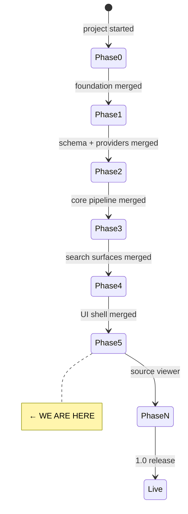

# State

> Last updated: 2026-05-10

## Progress

- **Phase 0** ✅ merged (PR #1) — Next.js 16 + Postgres compose, CI green, MIT license.
- **Phase 1** ✅ merged (PR #2) — 13 tables across 4 migrations, 5 provider fakes, repository layer scaffold, taxonomy seed, 45 Testcontainers-backed tests.
- **Docs pass** ✅ merged (PR #3) — README rewrite, mkdocs Material site (`docs/index.md`, `user-guide.md`, `changelog.md`).
- **Phase 2** ✅ merged (PR #4) — pg-boss queues + worker sidecar, parse/extract/embed handlers, SSE progress via `pg_notify`, real OpenAI-compat LLM + embedding adapters, Docling + Mistral OCR adapters, `/api/sources` upload, `/api/recommendations` keyword search, end-to-end pipeline test, fixture corpus.
- **Phase 3** ✅ merged (PR #5) — `/api/search` (hybrid RRF), `/api/keyword-search` (keyword + degrade path), `POST /api/chat-search` (streaming RAG over `source_pages` with `[[source:slug#page:N]]` citations), 60s query embedding cache, citation marker grammar.
- **Codex review fixes** ✅ merged (PR #6) — chat-search DB pool leak; query-embedding-cache NUL byte that broke git's diff classification.
- **Phase 4** ✅ implementation done (PR pending) — shadcn/ui-based primitives, dark mode (next-themes), three route groups `(app)/(marketing)/(auth)`, mode-aware root redirect, `<FeatureGate>`, Navigation + Footer, DecisionFlow first-launch flow, dashboard stub with recent jobs + sources cards.
- **Phase 5** 🔧 starting — split-pane source viewer (markdown + original PDF, synced scroll).

## Component Status

| Component | Status | Notes |
|-----------|--------|-------|
| Next.js app shell | ✅ | App Router, TS strict, Tailwind v4, ESLint flat |
| Postgres + pgvector | ✅ | Docker compose, 4 migrations applied, taxonomy seeded |
| Drizzle schema | ✅ | 13 tables, tsvector via `customType` |
| Provider interfaces | ✅ | auth, llm, embedding, ocr, storage (fakes only) |
| Repository layer | 🔧 | `source` + `recommendation` repos; more to follow per phase |
| pg-boss queues | ✅ | `src/lib/jobs/queue.ts`, dedicated `pgboss` schema |
| Worker sidecar | ✅ | `src/worker.ts`, runs in compose `worker` service |
| Real LLM / embedding adapter | ✅ | OpenAI-compat (`@ai-sdk/openai-compatible`); Ollama/OpenAI/Together/etc via env |
| Real OCR adapters | ✅ | Docling sidecar (`docker-compose.docling.yml`) + Mistral cloud |
| SSE progress stream | ✅ | `pg_notify` → `/api/jobs/[id]/stream` |
| Upload + keyword search endpoints | ✅ | `POST /api/sources`, `GET /api/recommendations?q=` |
| Search service + RRF SQL | ✅ | `src/lib/services/search.ts`, `search-sql.ts` (hybrid + keyword + source pages) |
| Hybrid + keyword search routes | ✅ | `GET /api/search`, `GET /api/keyword-search` |
| Streaming chat-search | ✅ | `POST /api/chat-search` via `streamText`; citation marker grammar |
| Query embedding cache | ✅ | 60s TTL / 256 entries, in-process LRU |
| App shell (nav, footer, dark mode, route groups) | ✅ | shadcn/ui + next-themes; `(app)`, `(marketing)`, `(auth)` |
| Mode-aware feature gating | ✅ | `getPublicConfig` + `<ConfigProvider>` + `<FeatureGate>` |
| DecisionFlow first-launch | ✅ | Framer Motion, persists via localStorage |
| Dashboard stub | ✅ | recent jobs + recent sources cards |
| TanStack Table / search UI / chat UI | ⏳ | Phase 6 |
| Source viewer (split-pane PDF) | ⏳ | Phase 5 |
| Better-auth / hosted mode | ⏳ | Phase 8 |

## Dependencies

| Dependency | Status | Notes |
|------------|--------|-------|
| Postgres 16 + pgvector | ✅ Working | via `docker compose up -d postgres` |
| Docker Desktop (Windows dev) | ⚠️ Manual start | daemon not auto-started on this box |
| pnpm 10.29.3 / Node 20 local, 22 in CI + Docker | ✅ Working | pinned via corepack |
| Vitest | ✅ Working | pinned to `^3.1.x` (rolldown/Windows issue with 4.x) |

## Carry-overs flagged for Phase 5+

- `uuid` columns for user refs (`owner_user_id`, `set_by_user_id`, `resolved_by`, `author_user_id`) have no FKs yet — wire up when Better-auth schema lands (Phase 8).
- Optional ESLint tweak: `@typescript-eslint/no-unused-vars` with `argsIgnorePattern: '^_'` to silence warnings on provider interfaces (currently 6 lint warnings, 0 errors).
- `drizzle-kit` `customType` emits `"undefined"."typename"` in ALTER statements — hand-edit required if we retrofit an existing column.
- `source_pages` has no generated `tsv` column. `searchSourcePages` computes `to_tsvector` inline at query time, bypassing the GIN path. If chat-search latency suffers, add a generated tsv + GIN index migration.
- `recommendations.status` filter intentionally deferred from `/api/search`. Status lives on the `recommendation_statuses` history table and needs a latest-per-rec lateral join — picking up in Phase 6 with the table UI.
- `/api/recommendations` is kept as the v1 keyword endpoint with the existing `snippet`/`rank` shape. Retire in Phase 6 once the table UI consumes `/api/keyword-search`.
- No rate limiting on the new search endpoints. `/api/chat-search` is the costliest (LLM streaming) — add before Phase 8 / hosted mode.
- `nomic-embed-text` recommends `search_query: ` / `search_document: ` prefixes for asymmetric retrieval. Skipped in Phase 3 to stay aligned with the unprefixed Phase-2 corpus; revisit if/when the corpus is re-embedded.
- Vitest's `environmentMatchGlobs` is deprecated; should migrate to `test.projects` configuration before vitest 4 lands.
- `listRecentJobs` reads `pgboss.job` directly. A pg-boss major bump (v13+) may rename columns and require an update.
- shadcn `components.json` chose `base-nova` preset (Base UI primitives, not Radix). If Radix becomes preferable later, swap via re-init.

**Resolved in Phase 2:**
- ~~`tsx` in devDependencies~~ → moved to prod deps; worker image and `pnpm db:migrate` work in the prod container.
