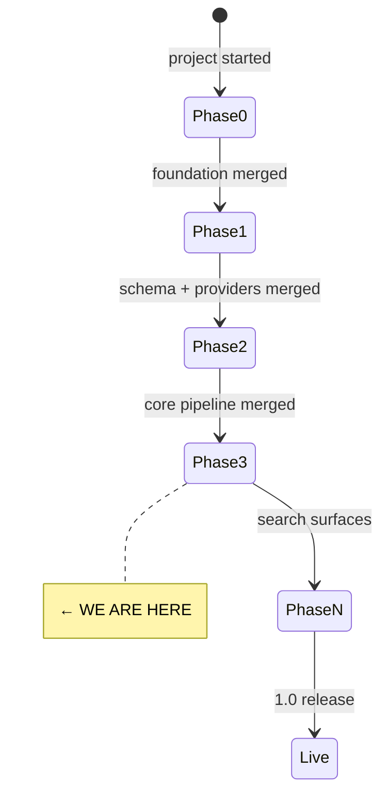

# State

> Last updated: 2026-05-09

## Progress

- **Phase 0** ✅ merged (PR #1) — Next.js 16 + Postgres compose, CI green, MIT license.
- **Phase 1** ✅ merged (PR #2) — 13 tables across 4 migrations, 5 provider fakes, repository layer scaffold, taxonomy seed, 45 Testcontainers-backed tests.
- **Docs pass** ✅ merged (PR #3) — README rewrite, mkdocs Material site (`docs/index.md`, `user-guide.md`, `changelog.md`).
- **Phase 2** ✅ merged (PR #4) — pg-boss queues + worker sidecar, parse/extract/embed handlers, SSE progress via `pg_notify`, real OpenAI-compat LLM + embedding adapters, Docling + Mistral OCR adapters, `/api/sources` upload, `/api/recommendations` keyword search, end-to-end pipeline test, fixture corpus.
- **Phase 3** 🔧 starting — search surfaces (hybrid RRF, keyword-only, streaming chat-search with citations).

## Component Status

| Component | Status | Notes |
|-----------|--------|-------|
| Next.js app shell | ✅ | App Router, TS strict, Tailwind v4, ESLint flat |
| Postgres + pgvector | ✅ | Docker compose, 4 migrations applied, taxonomy seeded |
| Drizzle schema | ✅ | 13 tables, tsvector via `customType` |
| Provider interfaces | ✅ | auth, llm, embedding, ocr, storage (fakes only) |
| Repository layer | 🔧 | `source` + `recommendation` repos; more to follow per phase |
| pg-boss queues | ✅ | `src/lib/jobs/queue.ts`, dedicated `pgboss` schema |
| Worker sidecar | ✅ | `src/worker.ts`, runs in compose `worker` service |
| Real LLM / embedding adapter | ✅ | OpenAI-compat (`@ai-sdk/openai-compatible`); Ollama/OpenAI/Together/etc via env |
| Real OCR adapters | ✅ | Docling sidecar (`docker-compose.docling.yml`) + Mistral cloud |
| SSE progress stream | ✅ | `pg_notify` → `/api/jobs/[id]/stream` |
| Upload + keyword search endpoints | ✅ | `POST /api/sources`, `GET /api/recommendations?q=` |
| Hybrid + chat search | ⏳ | Phase 3 |
| UI (DecisionFlow, TanStack Table, etc.) | ⏳ | Phase 4+ |
| Better-auth / hosted mode | ⏳ | Phase 8 |

## Dependencies

| Dependency | Status | Notes |
|------------|--------|-------|
| Postgres 16 + pgvector | ✅ Working | via `docker compose up -d postgres` |
| Docker Desktop (Windows dev) | ⚠️ Manual start | daemon not auto-started on this box |
| pnpm 10.29.3 / Node 20 local, 22 in CI + Docker | ✅ Working | pinned via corepack |
| Vitest | ✅ Working | pinned to `^3.1.x` (rolldown/Windows issue with 4.x) |

## Carry-overs flagged for Phase 3+

- `uuid` columns for user refs (`owner_user_id`, `set_by_user_id`, `resolved_by`, `author_user_id`) have no FKs yet — wire up when Better-auth schema lands (Phase 8).
- Optional ESLint tweak: `@typescript-eslint/no-unused-vars` with `argsIgnorePattern: '^_'` to silence warnings on provider interfaces (currently 6 lint warnings, 0 errors).
- `drizzle-kit` `customType` emits `"undefined"."typename"` in ALTER statements — hand-edit required if we retrofit an existing column.

**Resolved in Phase 2:**
- ~~`tsx` in devDependencies~~ → moved to prod deps; worker image and `pnpm db:migrate` work in the prod container.
